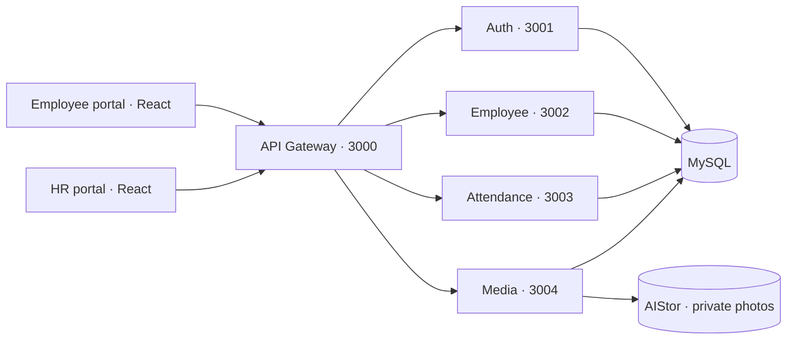

# Employee Attendance System

A full-stack attendance platform with separate employee and HR portals. Employees record attendance with a photo and device location; HR manages employee accounts, holidays, attendance records, and daily monitoring.

Built as a TypeScript monorepo with **React**, **five NestJS microservices**, **MySQL**, and private S3-compatible photo storage.

## Live demo

| Portal | URL | Email | Password |
| --- | --- | --- | --- |
| HR | [hr.annastriwidagdo.me](https://hr.annastriwidagdo.me) | `hr@testcompany.com` | `TestCompany123` |
| Employee | [attendance.annastriwidagdo.me](https://attendance.annastriwidagdo.me) | `john.doe@testcompany.com` | `TestCompany123` |

These are intentionally public demo accounts for **Test Company**, using fictional employees and simulated historical attendance. HR can use the management features, so demo data may change. Use the matching portal for each role. Camera and location permissions are needed for recording new attendance.

Explore HR monitoring for **August–September 2026** to see sample records for five employees, including late arrivals, early departures, and missing attendance. Historical sample photos are synthetic illustrations.

## Features

| Employee portal | HR portal |
| --- | --- |
| Role-specific login and password change | Dashboard and daily attendance monitoring |
| Today's attendance and schedule | Employee creation, editing, activation, archive, and restore |
| Check-in/check-out with photo and location | Account provisioning and temporary password reset |
| One-face detection, blink capture, manual fallback | Department and position management |
| Photo preview and retake | Holiday calendar management |
| Late/early departure reasons | Search, filters, pagination, and historical records |
| Personal history and private photo access | Attendance details with photos and Leaflet maps |
| Retry and uncertain-result handling | Attendance soft delete/restore with reasons and audit |

See the [feature guide](docs/features.md) for role boundaries. Face detection assists capture; the application does not perform biometric identity matching or geofencing.

## Architecture



Each backend runs as a separate process/container with its own API and table ownership. One MySQL database has service-specific users and restricted grants; services exchange data through HTTP rather than querying each other's tables. Durable operations and an outbox support retries across service boundaries.

| Layer | Technology |
| --- | --- |
| Frontend | React 19, TypeScript, Vite, HeroUI, shared custom components |
| Backend | NestJS, REST APIs, JWT sessions, bcrypt |
| Database | MySQL 8.4, Prisma 7, versioned SQL migrations |
| Photo storage | MinIO AIStor Free, private buckets, temporary signed URLs |
| Capture/maps | MediaPipe Tasks Vision, browser Geolocation, Leaflet |
| Tests | Jest, Vitest, React Testing Library; focused integration tests when needed |
| Delivery | GitHub Actions, GHCR, Docker Compose, Ubuntu/Nginx, Vercel, Cloudflare |

Read the [architecture](docs/architecture.md) and [database/ERD](docs/database.md).

## Run locally

Requirements: Node.js **24.x, minimum 24.15.0**, pnpm **10.28.0**, Git, Docker Compose, and an AIStor Free license for the photo service.

```sh
git clone https://github.com/annastriw/employee-attendance-system.git
cd employee-attendance-system
git switch dev
npm install --global pnpm@10.28.0
pnpm install --frozen-lockfile
```

Follow the [local setup guide](docs/getting-started.md) for private environment files, MySQL/AIStor, migrations, a local HR account, and the seven applications. A clean clone does not include live credentials or an AIStor license. Public demo accounts belong to the hosted demo; local credentials are generated separately.

## Development and delivery

```text
dev locally → focused unit tests → manual UI check → push dev
→ PR dev to main → CI → merge → Vercel / VPS automatic deployment
```

`dev` runs locally; `main` is the live release branch. Backend changes build cached images in GitHub Actions; VPS pulls the exact release, applies new migrations when needed, and checks health. Frontend-only changes deploy through Vercel without updating the VPS backend.

Development uses **Specification-Driven Development (SDD)** and a **Kanban workflow**: define rules and contracts, implement one complete feature, verify the changed logic, review manually, then release. See [development](docs/development.md) and [deployment](docs/deployment.md).

## Repository

```text
apps/          two React portals and five NestJS services
packages/      shared UI and database client wrapper
prisma/        schema and SQL migrations
infra/         Compose, Docker images, proxy and deploy configuration
scripts/       local setup, database grants, demo importer, deployment
docs/          guides, architecture decisions, module specifications
tasks/         roadmap and accepted feature status
```

## Documentation

- [Local setup](docs/getting-started.md)
- [Features and demo walkthrough](docs/features.md)
- [Architecture and service boundaries](docs/architecture.md)
- [Database design and ERD](docs/database.md)
- [API reference](docs/api.md)
- [Development: SDD, Kanban, tests, and Git](docs/development.md)
- [Deployment and automatic releases](docs/deployment.md)
- [Module specifications](docs/sdd/README.md)
- [Security and audit scope](docs/security.md)

Private environment files, tokens, deployment keys, licenses, backups, and photo data are excluded from Git. The public demo password is an explicit exception; it is not a database, storage, or deployment credential.
