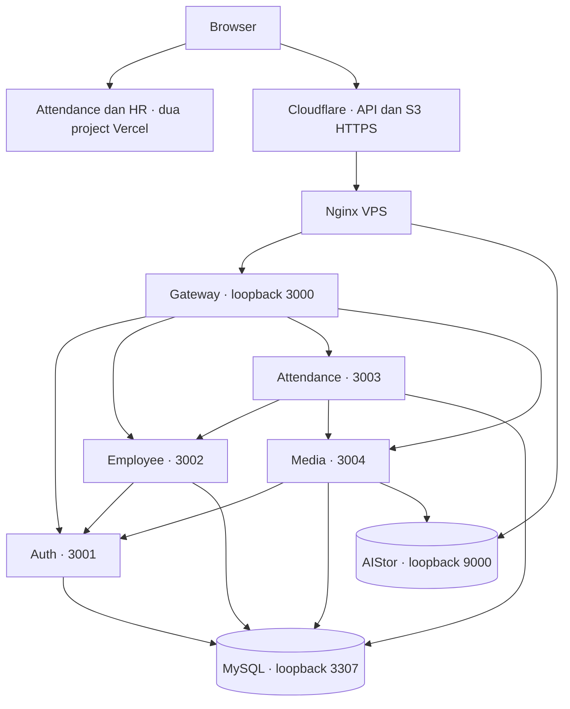

# Arsitektur aplikasi

Satu monorepo, dua portal React, lima proses NestJS. Pemisahan service berdasarkan tanggung jawab dan kepemilikan data, bukan jumlah repository.

| Service | Port | Tanggung jawab | Data |
| --- | --- | --- | --- |
| API Gateway | 3000 | Route allowlist, CORS, proxy header/cookie, requestId, batas request | Tidak mengakses DB |
| Auth | 3001 | Login role, JWT/session, refresh/revokasi, password, akun provisioning | `auth_*` |
| Employee | 3002 | Master, profil, lifecycle/history, koordinasi akun | `emp_*` |
| Attendance | 3003 | Jadwal, libur, eligibility, presensi, monitoring, lifecycle/outbox | `att_*` |
| Media | 3004 | Validasi/normalisasi foto, metadata, signed URL, cleanup orphan | `media_*` dan S3 |

## Deployment dan transport

Service bisnis juga memeriksa sesi melalui Auth. Diagram menampilkan jalur utama; bukan semua request internal. Transport memakai REST/HTTP, bukan broker NestJS/RabbitMQ. Durable operation/outbox menyediakan pemulihan lintasservice dengan HTTP idempotent.

Backend VPS container terpisah memakai host networking dan bind loopback; infra MySQL/AIStor menggunakan Compose lain. Nginx host memublikasikan Gateway dan S3 lewat domain HTTPS. Console AIStor 9001 tetap loopback. Dua portal memakai API Gateway; DB, secret internal dan private key tidak masuk bundle frontend.

## Data dan konsistensi

- Satu MySQL dengan satu schema/migration terpusat; runtime user berbeda dan grants terbatas pada tabel miliknya.
- FK berada di dalam domain service. Employee/account/photo lintas domain direferensikan lewat ID dan divalidasi lewat API, bukan cross-service join runtime.
- Attendance menyalin departemen/jabatan dan jadwal ke snapshot agar riwayat tidak berubah mengikuti profil terbaru.
- Transaksi MySQL menyimpan event presensi dan outbox bersama. Worker melakukan retry binding foto; lease dan key mencegah worker menganggap pekerjaan yang sama sebagai operasi baru.
- Provisioning Employee–Auth mempunyai record durable, retry, dan kompensasi bila proses tidak dapat diselesaikan.
- Pengiriman bersifat dapat diulang; bukan jaminan exactly-once lintas jaringan. Deduplikasi dan constraint memastikan hasil domain konsisten.

## Struktur frontend

React/Vite menjalankan portal terpisah. `packages/ui` menampung token tema, brand dan shell autentikasi yang digunakan bersama; komponen domain tetap pada portal masing-masing. Atomic Design dipakai saat tanggung jawab/reuse nyata membutuhkan pemisahan. API client menangani cookie refresh, token dalam memori, dan retry/validasi respons.

Tema zinc/emerald, Geist, HeroUI dan ikon Phosphor diterapkan pada kedua portal. Capture MediaPipe berjalan di browser; backend tetap memvalidasi metadata/foto dan menentukan waktu resmi.

## Keputusan dan batas

[ADR storage](architecture/adr-001-object-storage.md), [tooling](architecture/adr-002-project-tooling.md), [topologi](architecture/adr-003-repository-and-deployment.md). [ERD](database.md) dan [SDD](sdd/README.md) menjelaskan kontrak domain. Satu VPS dan AIStor single-node tidak menyediakan high availability; load test/restore drill tidak dinyatakan lulus dari health endpoint.
