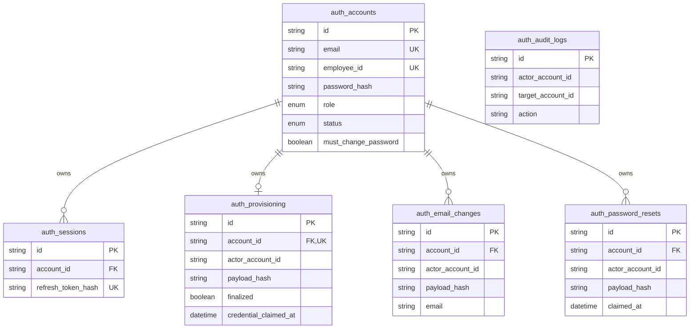
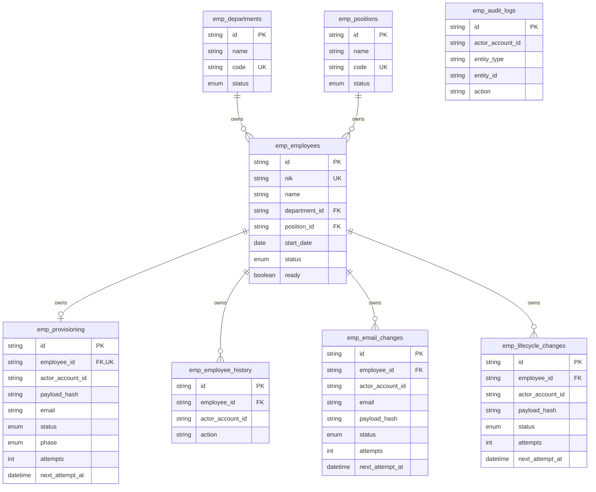
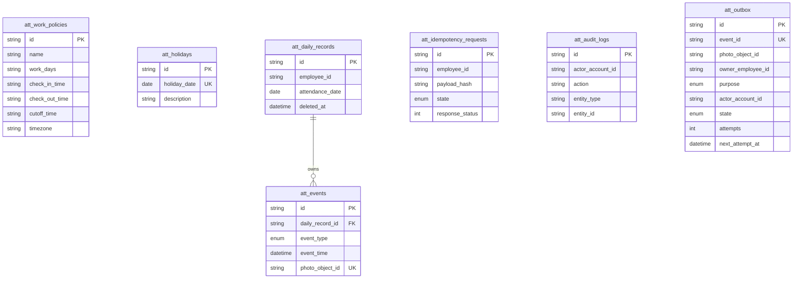
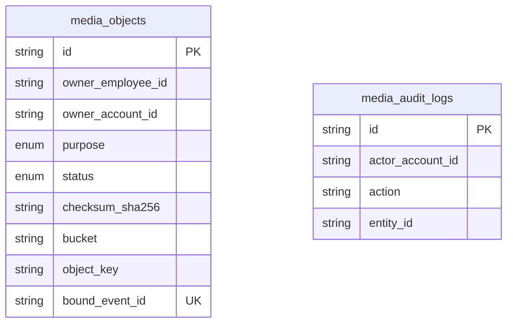
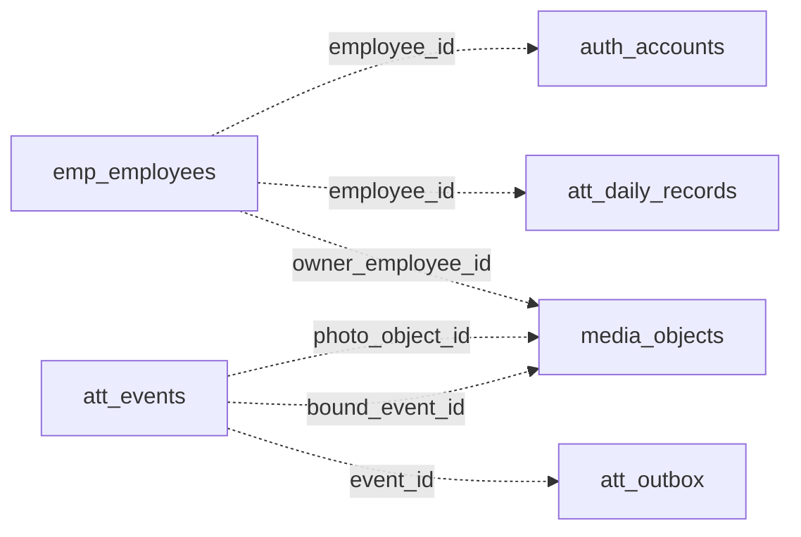

# Database dan ERD

Sumber struktur: [schema Prisma](../prisma/schema.prisma) dan [migration SQL](../prisma/migrations/). MySQL 8.4 memakai InnoDB, utf8mb4, ID UUID CHAR(36), timestamp DATETIME(3) UTC, serta DATE untuk tanggal kerja WIB.

Ada **23 tabel domain**: 6 Auth, 8 Employee, 7 Attendance, 2 Media. `_prisma_migrations` adalah metadata migrasi, bukan tabel bisnis. Satu schema dikelola terpusat; runtime user berbeda hanya mengakses tabel service pemiliknya.

## Cara membaca ERD

Diagram berikut menunjukkan tabel yang benar-benar dimodelkan serta field penting. PK adalah primary key, FK adalah foreign key fisik dalam domain, UK adalah unique field tunggal. Nullability dan seluruh field/index ada di schema/migration. Relasi lintasservice ditampilkan terpisah sebagai referensi logis, bukan FK MySQL.

## Auth

## Employee

## Attendance

## Media

## Referensi logis lintasservice

Panah menunjukkan ID yang dihubungkan oleh kontrak aplikasi, bukan arah foreign key atau akses langsung antarservice. Auth.employee_id unik/nullable membedakan akun HR tanpa profil karyawan. Attendance mengambil eligibility/profil dari Employee melalui HTTP, Media memvalidasi owner dan binding melalui API.

## Constraint dan riwayat

- Email akun, NIK, kode/nama departemen/jabatan unik; nilai milik profil arsip tetap dicadangkan.
- UNIQUE(employee_id, attendance_date) berlaku juga untuk soft-deleted record.
- UNIQUE(daily_record_id, event_type) membatasi satu CHECK_IN dan satu CHECK_OUT; UNIQUE(photo_object_id) mencegah reuse bukti event.
- Media: UNIQUE(owner_employee_id, idempotency_key), UNIQUE(bucket, object_key), dan bound_event_id unik.
- Snapshot departemen/jabatan di daily record dan policy_snapshot pada event menjaga riwayat dari perubahan konfigurasi kemudian.
- Holiday date unik. Kalender bukan foreign key event; hasil jadwal disalin ke snapshot saat presensi.
- Audit mencatat actor, action, requestId dan waktu. Runtime hanya SELECT/INSERT audit; tidak UPDATE/DELETE.
- Idempotency/provisioning/email/lifecycle/outbox menyimpan state, payload hash dan lease/retry untuk pemulihan operasi.

## Kepemilikan dan hak akses

| User runtime | Tabel | Batas |
| --- | --- | --- |
| attendance_auth | auth_* | SELECT/INSERT/UPDATE domain; audit SELECT/INSERT |
| attendance_employee | emp_* | SELECT/INSERT/UPDATE domain; history/audit SELECT/INSERT |
| attendance_attendance | att_* | Hak sesuai operasi presensi/kalender; audit SELECT/INSERT |
| attendance_media | media_* | SELECT/INSERT/UPDATE metadata; audit SELECT/INSERT |
| attendance_migrator | Database target | DDL/migration, bukan user runtime |

Daftar grant lengkap ada di [script setup](../scripts/database/setup-local.mjs). Tidak semua tabel mendapat hak seragam; misalnya kalender dapat dihapus sesuai aturan bisnis. Development/test memakai schema berbeda pada satu instance lokal. Production menggunakan database terpisah dari lokal.

## Migration dan koneksi

Prisma 7 menggunakan adapter PrismaMariaDb untuk berkomunikasi dengan **MySQL**; nama adapter tidak mengganti mesin DB menjadi MariaDB. Client dibangun di packages/database, tidak dibundel ke frontend. URL runtime berasal dari environment privat.

Migration SQL versioned dan urut; tidak menggunakan schema reset pada live. CLI migration memakai user migrator, kemudian grants runtime diperbarui bila tabel baru perlu akses. Backup dibuat sebelum migration live; rollback image tidak otomatis mengembalikan schema/data. [Setup lokal](getting-started.md), [deployment](deployment.md).
