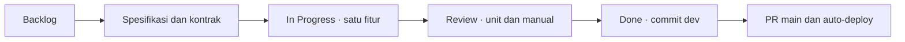

# Development dengan SDD dan Kanban

Coding langsung di `dev`; `main` adalah branch live. Kerja serial, satu increment aktif. Source dan spesifikasi berubah bersama agar aturan bisnis, API dan UI tetap sinkron.

## Siklus kerja

Mulai dari [analisis kebutuhan](requirements/analysis.md) dan [PRD](requirements/prd.md). [Siklus SDD lengkap](sdd/lifecycle.md) menghubungkan kebutuhan, desain/ERD/API/UI, implementasi, testing dan auto-deployment. Langkah berikut merinci increment harian.



1. Pilih satu fitur/perbaikan dari backlog. Baca baseline, SDD module, dan source aktual.
2. Tetapkan aturan/state, payload, error dan acceptance sebelum implementasi. Perubahan kecil cukup memperbarui kontrak yang ada; tidak perlu dokumen baru untuk setiap berkas.
3. Implementasikan satu alur lengkap: schema/kontrak → backend → UI. Pertahankan controller/DTO/service serta kepemilikan data. Reuse pola form/list/detail dan komponen bersama bila tanggung jawabnya sama.
4. Jalankan unit logika berubah, lint/typecheck/build bagian relevan. Integrasi cepat bila risiko DB/storage/auth/antarservice berubah. Pengguna memeriksa UI/alur secara manual.
5. Review diff, update SDD dan status task dengan hasil aktual. Commit/push satu perubahan logis ke dev; fitur diterima setelah pengguna mengatakan oke untuk scope itu.
6. Saat siap live, PR dev → main, tunggu CI head terbaru hijau, merge, lalu periksa fitur live. [Deployment](deployment.md).

## SDD yang dipakai

SDD berarti aturan dan kontrak menjadi acuan implementasi, bukan menambah dokumen sebanyak mungkin. [Baseline](requirements/baseline.md) mendefinisikan scope; [SDD module](sdd/README.md) menjelaskan invariant/state/kontrak; [ADR](architecture/) merekam alasan keputusan yang mahal diubah. Source/schema menjadi bukti struktur aktual.

Jika keputusan berubah, perbarui spesifikasi pada increment yang sama. Jangan mengarang tanggal, hasil tes atau penerimaan manual. Catatan lama yang sudah digantikan bukan aturan aktif.

## Agile Kanban

Backlog → In Progress → Review → Done. WIP satu increment untuk menjaga dependensi dan context. Task dipecah menjadi fitur ujung ke ujung yang dapat diverifikasi; bukan menyelesaikan seluruh DB, lalu seluruh API, baru seluruh UI. Feedback manual diterapkan pada increment berikutnya.

Kanban di proyek ini berupa task/checklist repository, bukan klaim adanya board Jira atau sprint yang tidak digunakan. Status Done membutuhkan acceptance sesuai scope. Pekerjaan operasional yang ditunda diberi status ditunda, bukan otomatis selesai.

## Testing cepat

```sh
pnpm --filter attendance-service test --runInBand
pnpm --filter hr-web exec vitest run src/pages/MonitoringPage.test.tsx
```

Pilih file/package yang benar-benar berubah. Integrasi cepat contoh bila query departemen berubah:

```sh
pnpm --filter employee-service test:e2e --runInBand --runTestsByPath test/departments.e2e-spec.ts
```

Gunakan DB/storage test lokal yang disiapkan, satu worker dan fixture sendiri. Tanpa suite integrasi/browser penuh rutin. Test Playwright/visual historis tetap alat tambahan, bukan gate harian. Dokumentasi saja cukup isi/tautan/diff. [Aturan testing](testing/workflow.md).

## Git sehari-hari

```sh
git switch dev
git fetch origin
git merge origin/main
# coding, verifikasi, periksa diff
git add <related-files>
git commit -m "feat: describe the completed change"
git push origin dev
```

Buka PR dengan base main, compare dev. Jangan mencentang hasil manual sebelum konfirmasi atau menyertakan .env/key/backup/data foto. Prefix commit feat/fix/docs/test/refactor/chore/perf sesuai perubahan. Tanpa force push untuk kerja harian.

Perapian history satu kali disetujui pemilik pada 2026-10-04; backup dan mapping privat mempertahankan tanggal commit sumber. Dokumentasi baru memiliki tanggal aktual, bukan dimasukkan sebagai perubahan lama.

## Handoff serial

[Tasks](../tasks/plan.md) menyimpan roadmap produk. Handoff ada di [tasks/progress.md](../tasks/progress.md). Catat satu task aktif, source terkait, verifikasi aktual, branch/commit, proses yang benar-benar berjalan dan langkah berikut. Agen berikut membaca status/diff aktual dan bekerja serial tanpa subagen. Jangan membuat ulang folder temporary atau commit berkas tooling/private pengguna hanya agar status terlihat kosong.
