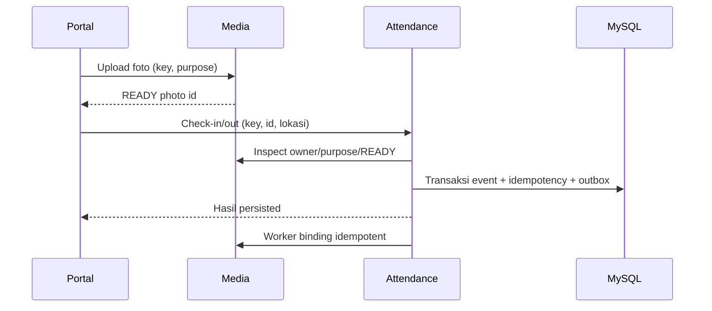

# SDD — Attendance

## Jadwal dan eligibility

Senin–Jumat 08.00–17.00 Asia/Jakarta. Waktu resmi dari server: check-in <=08.00 tepat waktu, sesudahnya late; checkout <17.00 early, mulai 17.00 normal. Late/early membutuhkan reason. Cutoff 23.59.59 WIB tanggal yang sama, tanpa checkout otomatis/lembur.

Akhir pekan/libur tidak wajib; presensi diberi outside schedule tanpa late/early. HR hanya mengubah kalender hari ini/future, dengan audit. Snapshot event lama tetap. Eligibility memakai startDate dan status/ready historis Employee.

## Capture dan pengiriman

Frontend mensyaratkan satu wajah, blink/manual fallback, preview/retake, kamera dan lokasi berizin. Manual tetap satu wajah valid; tanpa biometric matching/geofence. UI menyediakan error/retry izin, device, model dan lokasi.

Backend menerima photo READY id, AUTO/MANUAL, clientCapturedAt dan latitude/longitude/accuracy/capturedAt. Lokasi maksimum umur 60 detik, toleransi masa depan 5 detik; foto tidak boleh bertimestamp lebih dari 5 detik ke depan. Waktu resmi tidak diambil dari clientCapturedAt.

Satu pasangan per employee/date. Checkout membutuhkan check-in dan dailyRecordId sendiri pada hari ini. Constraint tetap setelah soft delete. Timeout bukan bukti gagal: UI mempertahankan key/payload dan memeriksa request status. Sukses UI hanya untuk hasil persisted.

## Snapshot, riwayat dan monitoring

Daily record menyimpan snapshot departemen/jabatan; event menyimpan policy, outside/late/early, reason, waktu dan lokasi. Perubahan profil/jadwal tidak mengevaluasi ulang hasil historis.

Karyawan hanya riwayat sendiri; HR mempunyai monitoring/detail dengan foto privat/peta. Missing dihitung dari roster eligible dan kalender: pending sebelum batas, missing setelah jam kerja; check-in tanpa checkout berarti pending checkout. Deleted dikeluarkan dari rekap aktif dan tidak dianggap missing.

## Delete/restore

HR mengonfirmasi karyawan/tanggal, mengirim version updatedAt serta reason untuk soft delete seluruh hari. Actor/time/reason diaudit. Waktu/foto/constraint tetap; karyawan melihat label tanpa foto, HR tetap boleh melihat bukti yang terhapus.

Restore memakai version terbaru dan data asli. Konflik ditolak, detail harus dimuat ulang sebelum konfirmasi. HR tidak dapat mengedit waktu/foto atau absen atas nama karyawan.

## Source dan verifikasi

[Service](../../apps/attendance-service/src/), [tests](../../apps/attendance-service/test/), [Attendance UI](../../apps/attendance-web/src/), [HR UI](../../apps/hr-web/src/). Unit: boundary 08.00/17.00/cutoff, holiday/snapshot, ownership, key/hash, event unik, deleted/missing dan eligibility. Integrasi cepat jika DB/Media/Employee berubah; kamera/GPS/UI manual. [API](../api.md), [ERD](../database.md#attendance), [recovery](recovery.md).
