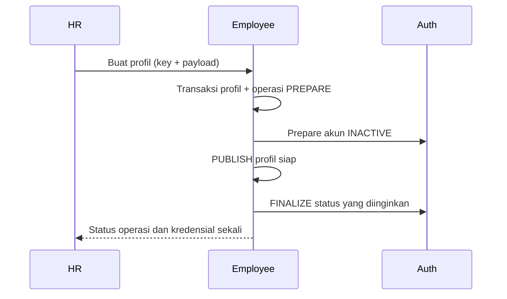

# SDD — Employee, master dan lifecycle

## Scope dan data

Employee memiliki profil, departemen, jabatan, history dan operasi durable. Profil: NIK unik, nama, telepon opsional, departemen/jabatan, startDate, status dan ready. Email dimiliki Auth; Employee menyimpan representasi untuk sinkronisasi profil.

Departemen/jabatan: kode/nama unik, ACTIVE/INACTIVE. Master nonaktif tidak boleh ditugaskan pada profil baru/edit. Data yang dipakai tidak dihapus permanen; profil historis/snapshot tidak ditulis ulang.

## Provisioning

State PENDING/COMPLETED/FAILED dan fase PREPARE/PUBLISH/FINALIZE dicatat durable. ready/status mencegah profil belum lengkap dipakai. Retry menggunakan operasi yang sama; konflik email dapat dikoreksi tanpa NIK duplikat. Kegagalan fatal sebelum finalize dikompensasi ke state aman. HR menyampaikan password sementara manual, tanpa email otomatis.

## Edit dan lifecycle

Edit profil memakai expectedUpdatedAt. Perubahan email memakai expectedEmail/key dan operasi durable Employee–Auth. NIK/email tetap dicadangkan setelah archive.

Lifecycle memakai expectedStatus/targetStatus ACTIVE/INACTIVE/ARCHIVED. INACTIVE/ARCHIVED menutup login dan mencabut sesi Auth. Restore menghasilkan INACTIVE; aktivasi terpisah. Operasi pending menolak perubahan yang konflik. History mencatat actor/requestId/before/after.

Reset password HR menghasilkan password sementara sekali, mustChangePassword=true dan revokasi sesi. HR tidak melihat hash/password lama. [Auth](auth.md).

## Integrasi Attendance

Endpoint internal menyediakan profil/roster dan history eligibility lewat autentikasi service. Attendance tidak membaca emp_* langsung. startDate, history status/ready dan snapshot mendukung perhitungan tanggal lampau sesuai kondisi historis.

## Source dan verifikasi

[Employee source](../../apps/employee-service/src/), [integration](../../apps/employee-service/test/), [HR UI](../../apps/hr-web/src/). Skenario: NIK/email konflik, master nonaktif, concurrent update, Auth offline/retry, credential sekali, archive/restore dan revokasi. Unit logika berubah; integrasi cepat untuk DB/Auth; UI manual. [API](../api.md), [ERD](../database.md#employee).
