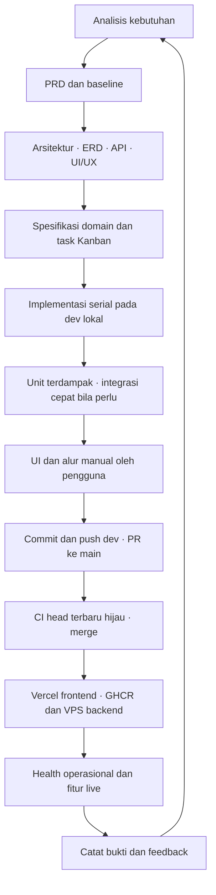

# Siklus SDD — kebutuhan sampai auto-deployment

SDD digunakan sepanjang siklus produk: kebutuhan menjelaskan masalah, PRD menentukan hasil, spesifikasi menetapkan kontrak, implementasi dan rilis dibuktikan sesuai perubahan. Analisis/PRD dirangkum pada 2026-10-05 dari keputusan existing; timestamp historis tetap mengikuti sumber asli.

## Tahap dan artefak

| Tahap | Pekerjaan | Acuan/hasil |
| --- | --- | --- |
| Analisis | Pengguna, masalah, kewenangan, kendala, non-goals | [Analisis](../requirements/analysis.md) |
| PRD | Tujuan, prioritas, acceptance; konfirmasi aturan bisnis baru | [PRD](../requirements/prd.md), [baseline](../requirements/baseline.md) |
| Desain | Batas service, data, API, state/alur layar dan keputusan penting | [Arsitektur](../architecture.md), [ERD](../database.md), [API](../api.md), [UI/UX](frontend-ui-ux.md), ADR |
| Spesifikasi/task | Invariant, error, retry, integrasi, acceptance; satu increment | [Domain SDD](README.md), [plan](../../tasks/plan.md), [todo](../../tasks/todo.md) |
| Implementasi | Schema/kontrak → backend → UI, serial pada dev lokal | Source/test/spec dalam satu perubahan logis |
| Verifikasi | Unit terdampak, integrasi cepat bila perlu, lint/build/typecheck relevan, UI manual | [Testing](../testing/workflow.md), konfirmasi pengguna |
| Promosi | Review, commit/push dev, PR base main/compare dev, CI terbaru hijau, merge | [Development](../development.md), CI/ruleset |
| Auto-deploy | Vercel frontend; backend berubah → build cached/GHCR image SHA → VPS; migration baru bila ada | [Deployment](../deployment.md), [runbook otomatis](../deployment/vps-auto-deploy.md) |
| Bukti/feedback | Health, fitur live, hasil aktual, kembali ke backlog | [Progress](../../tasks/progress.md), acceptance terkait |

## Menjaga workflow singkat

Gunakan dokumen existing dan perbarui hanya kebutuhan/kontrak terdampak. ADR baru untuk keputusan arsitektur penting. Satu increment aktif, berupa satu fitur ujung ke ujung; bukan seluruh schema/API/UI sebagai fase terpisah.

Checkbox UI hanya setelah pengguna mengatakan oke untuk scope itu. CI unit sekali serta lint/build/typecheck sesuai konfigurasi. Integrasi perlu dibuktikan terfokus sebelum rilis, tidak diulang sebagai suite penuh pada VPS. Deployment memakai migration dan health operasional; tanpa Playwright rutin.

Vercel dan backend dapat selesai pada waktu berbeda. Frontend-only/dokumentasi tidak memerlukan image backend baru. Jaga kompatibilitas kontrak saat frontend/backend berubah bersamaan. Health bukan pengganti acceptance fitur.

## Contoh keterlacakan: check-in

Kebutuhan: kehadiran dengan bukti. PRD: presensi mandiri, foto/lokasi dan waktu resmi. Baseline/SDD: satu check-in per tanggal, alasan keterlambatan, validasi media dan retry idempotent. ERD/API: daily record, event dan referensi media sesuai kepemilikan service. Implementasi: Attendance/Media/Gateway dan layar capture. Verifikasi: unit aturan berubah, integrasi cepat jika kontrak/storage berubah, UI manual. Rilis: PR main, delivery otomatis sesuai perubahan, health dan skenario live.

Contoh ini menjelaskan hubungan artefak, bukan klaim seluruh pengujian dijalankan ulang saat dokumentasi ditulis. Bukti tetap merujuk task/progress aktual.
